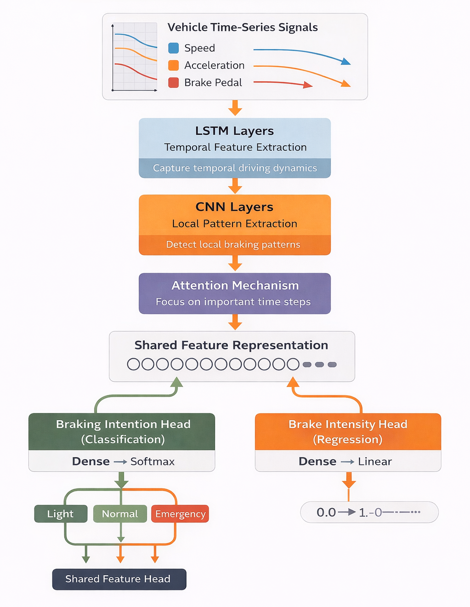

# Driver Braking Intention Recognition for EVs

## Overview
This project builds a deep learning system that predicts how a driver is braking using vehicle time-series signals such as:

- Vehicle speed
- Acceleration (deceleration)
- Brake pedal input

The model predicts:

- Braking intention — Light / Normal / Emergency
- Brake intensity — a continuous value representing braking aggressiveness

Why this matters?
- Early braking prediction can improve vehicle safety systems and driver assistance technologies.
- If a car detects emergency braking earlier, safety systems can react faster.
- For electric vehicles, braking intensity prediction can also help optimize regenerative braking, improving energy recovery and efficiency.

---

## Demo


---

## Model Architecture



---

## Quantitative Results

| Model | Accuracy | Macro F1 | Normal Braking F1 | Emergency Braking F1 |
|------|----------|----------|-------------------|----------------------|
| Baseline (Single-task) | 69.6% | 70% | ~59% | ~78% |
| AE + Classifier (Best) | 64.1% | 64% | ~56% | ~77% |
| Multitask (λ = 0.5) | 69.0% | 70% | ~57% | ~77% |
| **Multitask (λ = 0.8)** | **71.3%** | **72%** | **59%** | **82%** |

Key result:
Multitask learning improved overall performance and achieved 82% F1-score for Emergency Braking, the most safety-critical class.

---

## Installation & Setup

Clone the repository and install dependencies:

```bash
git clone https://github.com/your-username/braking-intention-prediction.git
cd braking-intention-prediction
pip install -r requirements.txt
```

(Optional) If using Jupyter notebooks:
```bash
python -m ipykernel install --user --name braking-intent
```

---

## How to Run

1. Generate Dataset
```bash
python data/generate_dataset.py
python data/generate_hard_dataset.py
```
This will create .npy files containing time-series samples and labels.

2. Train Baseline Model

Open and run:
```
01_train_baseline.ipynb
```
3. Train Final Multitask Model

Open and run:
```
02_multitask_training.ipynb
```
All results, confusion matrices, and metrics are produced inside the notebooks.

4. Run the Interactive Demo
```bash
streamlit run app.py
```

---

## Assumptions & Design Choices

### Key assumptions

- Vehicle signals are synthetically generated to simulate realistic braking scenarios.

- Short time windows of speed, acceleration, and brake input are sufficient to estimate braking intention.

- Brake intensity correlates with braking aggressiveness.

### Limitations
- Model is trained on synthetic data; real-world deployment would require:
  - Sensor calibration
  - Domain adaptation
  - Validation on real driving datasets
- Reaction latency, road conditions, and driver intent beyond braking are not modeled.

---

## References

This project reproduces and extends ideas from the following research work:

Wei Yang, Yu Huang, Kongming Jiang, Zhen Zhang, Ketong Zong, Qin Ruan,  
**“Method of Predicting Braking Intention Using LSTM-CNN-Attention With Hyperparameters Optimized by Genetic Algorithm”**,  
*International Journal of Control, Automation and Systems*, Springer, 2024. 
(https://link.springer.com/article/10.1007/s12555-021-1113-x)

The original paper proposes an LSTM–CNN–Attention architecture for braking intention prediction using simulator-based driving data.  

This project reimplements the core architecture and introduces:
- harder ambiguous synthetic datasets
- systematic ablation studies
- multitask learning with braking intensity regression
